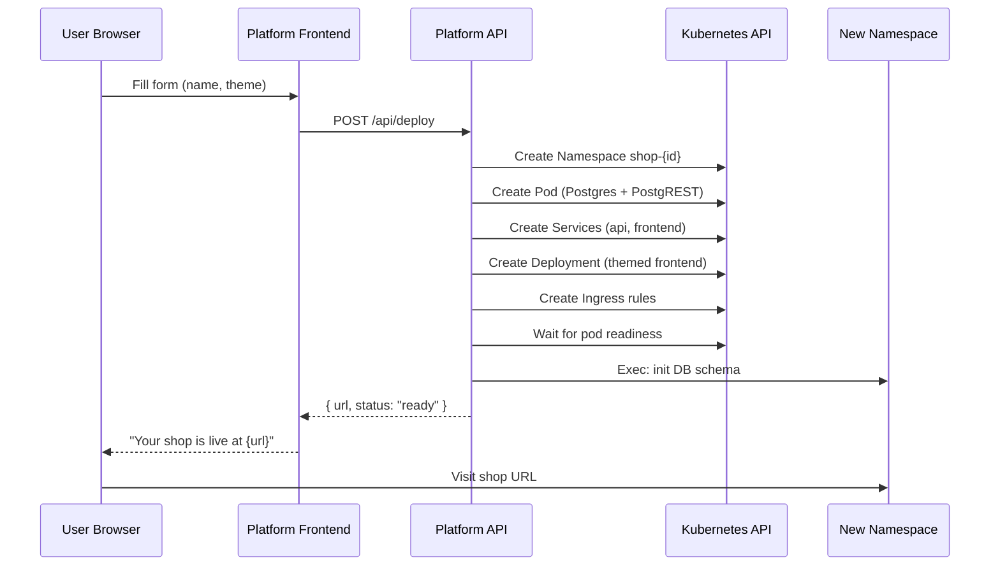

# Main Loop: Deployment Form → Dynamic K8s Provisioning → Live URL

## Overview

This is the **core product loop** of Schlopify. A user visits the platform, fills out a minimal deployment form (shop name, theme), clicks submit, and the system dynamically provisions a fully isolated Kubernetes tenant stack (namespace, PostgreSQL + PostgREST sidecar pod, themed frontend deployment, services, ingress) and returns a live URL.

### What Exists Today

- **Platform Frontend** (`platform-frontend/`) — React SPA with landing page and auth forms. Deployed at `schlopify.192.168.49.2.nip.io`
- **Auth Service** (`auth/`) — Go service with JWT auth, register/login endpoints
- **Shop Frontend** (`frontend/`) — Multi-theme React storefront with brutalist/minimal themes, ThemeProvider, component registry
- **Static K8s Manifests** (`k8s/`) — Hardcoded YAML for a single `shop-1` namespace, manually applied via `deploy.sh`
- **No control plane** — POC explicitly excluded multi-tenant orchestration

### What We're Building

The **Control Plane API** — a new Go service that programmatically creates tenant infrastructure via the Kubernetes API.

---

## Proposed Changes

### Component 1: Platform API (Control Plane)

> [!IMPORTANT]
> This is a **new service** — the core orchestration engine that translates a form submission into live infrastructure.

#### [NEW] [platform-api/](file:///home/shreyasbg/Desktop/schlopify/platform-api/)

A Go HTTP server that:
1. Accepts `POST /api/deploy` with `{ "shop_name": "...", "theme": "brutalist" | "minimal" }`
2. Sanitizes the shop name → generates a `shop_id` (e.g., `shop-cool-kicks`)
3. Uses `client-go` to programmatically create K8s resources:
   - **Namespace** `shop-{id}`
   - **Pod** `shop-db` (PostgreSQL + PostgREST sidecar) — same spec as existing `pod-shop-db.yaml`
   - **Service** `shop-api` (ClusterIP → PostgREST 3000)
   - **Service** `shop-frontend` (ClusterIP → NGINX 80)
   - **Deployment** `shop-frontend` (themed React app with `VITE_THEME` env var baked into build, or passed as env)
   - **Ingress** rules for `{shop_id}.192.168.49.2.nip.io`
4. Waits for pod readiness
5. Runs DB schema init via `kubectl exec` equivalent (client-go remotecommand)
6. Returns `{ "url": "http://{shop_id}.192.168.49.2.nip.io", "status": "ready" }`

##### Key files:

| File | Purpose |
|------|---------|
| `platform-api/main.go` | HTTP server, `/api/deploy` handler, CORS |
| `platform-api/provisioner.go` | K8s client-go logic: create namespace, pod, services, deployment, ingress |
| `platform-api/templates.go` | Go structs that build K8s object specs programmatically |
| `platform-api/schema.sql` | Embedded SQL init script (copy of existing `db-init.sql`) |
| `platform-api/go.mod` | Module with `k8s.io/client-go`, `k8s.io/apimachinery` deps |
| `platform-api/Dockerfile` | Build the Go binary |

##### Theme Handling Strategy:

> [!IMPORTANT]
> **Decision point:** How does the frontend know which theme to render?

**Approach: Environment variable at build time is not viable** (we'd need to rebuild the Docker image per theme). Instead:

- The **same** `shop-frontend` image is deployed for every tenant (pre-built with all themes included)
- The theme is injected as an **environment variable** (`SHOP_THEME=brutalist`) into the frontend's NGINX container
- NGINX serves a small init script that reads the env var and injects it as `window.__SCHLOPIFY_THEME__` into `index.html`
- The React `ThemeProvider` reads `window.__SCHLOPIFY_THEME__` to resolve which theme to lazy-load

This means **one Docker image, infinite theme configurations** — no rebuild needed per deployment.

---

### Component 2: Frontend Theme Injection

#### [MODIFY] [frontend/nginx.conf](file:///home/shreyasbg/Desktop/schlopify/frontend/nginx.conf)

Add a `sub_filter` directive that injects the theme env var into the HTML response:

```nginx
location / {
    sub_filter '</head>' '<script>window.__SCHLOPIFY_THEME__="$SHOP_THEME";</script></head>';
    sub_filter_once on;
    try_files $uri $uri/ /index.html;
}
```

The `$SHOP_THEME` variable comes from an NGINX env substitution at container startup (using `envsubst` in the entrypoint).

#### [MODIFY] [frontend/Dockerfile](file:///home/shreyasbg/Desktop/schlopify/frontend/Dockerfile)

Update entrypoint to run `envsubst` on `nginx.conf` before starting NGINX, so `$SHOP_THEME` is resolved from the container's environment.

#### [MODIFY] [ThemeProvider.tsx](file:///home/shreyasbg/Desktop/schlopify/frontend/src/registry/ThemeProvider.tsx)

Read `window.__SCHLOPIFY_THEME__` as the default theme name instead of hardcoding.

#### [MODIFY] [App.jsx](file:///home/shreyasbg/Desktop/schlopify/frontend/src/App.jsx)

Pass the theme from `window.__SCHLOPIFY_THEME__` (or a fallback default like `"minimal"`) to the `ThemeProvider`.

---

### Component 3: Platform Frontend (Deployment Form)

#### [MODIFY] [platform-frontend/src/App.jsx](file:///home/shreyasbg/Desktop/schlopify/platform-frontend/src/App.jsx)

Add a **new view** after login/signup: the **Dashboard** with a deployment form.

The form collects:
- **Shop Name** (text input, validated for URL-safety)
- **Theme** (radio/card selector showing brutalist & minimal previews)

On submit:
1. `POST` to the Platform API (`/api/deploy`)
2. Show a loading/provisioning state with progress animation
3. On success, display the live URL as a clickable link

The dashboard view will follow the existing design system (Syne font, neon chartreuse accent, glassmorphism cards).

---

### Component 4: K8s Infrastructure

#### [NEW] [k8s/platform-api-deployment.yaml](file:///home/shreyasbg/Desktop/schlopify/k8s/platform-api-deployment.yaml)

Deployment + Service for the platform-api in the `schlopify-platform` namespace.

#### [NEW] [k8s/platform-api-rbac.yaml](file:///home/shreyasbg/Desktop/schlopify/k8s/platform-api-rbac.yaml)

> [!WARNING]
> The Platform API pod needs **cluster-wide permissions** to create namespaces, pods, services, deployments, and ingresses. This requires a `ClusterRole` and `ClusterRoleBinding` bound to the platform-api's `ServiceAccount`.

RBAC resources:
- `ServiceAccount` in `schlopify-platform`
- `ClusterRole` with create/get/list/watch on namespaces, pods, pods/exec, services, deployments, ingresses
- `ClusterRoleBinding` binding the SA to the role

#### [MODIFY] [ingress-platform.yaml](file:///home/shreyasbg/Desktop/schlopify/k8s/ingress-platform.yaml)

Add a path rule to route `/api/*` requests on `schlopify.192.168.49.2.nip.io` to the `platform-api` service (so the frontend can `POST /api/deploy`).

#### [MODIFY] [deploy.sh](file:///home/shreyasbg/Desktop/schlopify/deploy.sh)

Add build/load/apply steps for the new `platform-api` service. Remove the hardcoded `shop-1` provisioning (that's now dynamic).

---

## Architecture Diagram



---

## Open Questions

> [!IMPORTANT]
> **Theme build approach:** The plan uses a single Docker image with all themes bundled and runtime selection via env var injection. This means the image contains both theme bundles (~extra 30KB). An alternative is building separate images per theme at deploy time, but this adds 30-60s build latency per deployment. **The runtime injection approach is recommended.** Agree?

> [!IMPORTANT]
> **nip.io for local dev:** Currently using `*.192.168.49.2.nip.io` for wildcard DNS. This works great for Minikube but obviously not for production. The plan keeps this pattern for now. Fine for this stage?

> [!IMPORTANT]
> **Auth integration:** The deployment form could sit behind the existing auth service (require login before deploying). Do you want this wired up now, or is the form accessible without auth for this iteration?

---

## Verification Plan

### Automated Tests

1. **Build all images:**
   ```bash
   docker build -t platform-api:v1 ./platform-api
   docker build -t shop-frontend:v5 ./frontend
   docker build -t platform-frontend:v4 ./platform-frontend
   ```

2. **Deploy the platform stack:**
   ```bash
   ./deploy.sh minikube
   ```

3. **End-to-end test via browser:**
   - Navigate to `http://schlopify.192.168.49.2.nip.io`
   - Fill in shop name: "cool-kicks", select "brutalist" theme
   - Submit the form
   - Verify provisioning animation appears
   - Verify returned URL is clickable
   - Navigate to the returned URL
   - Verify the brutalist theme renders correctly
   - Verify `/api/products` returns JSON from the new shop's PostgREST

4. **Verify isolation:**
   ```bash
   kubectl get namespaces | grep shop-
   kubectl get pods -n shop-cool-kicks
   ```

### Manual Verification
- Deploy a second shop with "minimal" theme and verify both shops are independently accessible
- Confirm each shop has its own PostgreSQL instance with separate data
